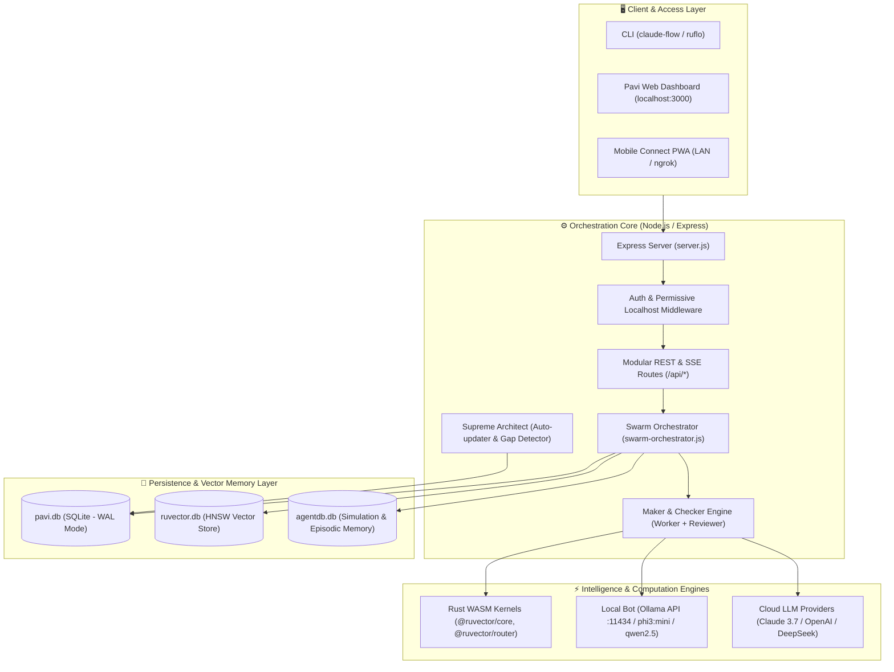

# System Architecture & Topology — RuFlo v3.5 & Pavi

> **Status:** Canonical Architectural Blueprint  
> **Platform Version:** RuFlo v3.5 / Pavi Enterprise  
> **Last Updated:** 2026-09-25

---

## 1. System Architecture Overview

RuFlo / Pavi is built on an asynchronous, decoupled architecture separating user interaction, orchestration logic, model execution, and persistent memory.

### 1.1 High-Level Architecture Diagram



---

## 2. Directory Structure & Key Files

```
ruflo-main/
├── bin/                          # Global executable wrappers
│   └── cli.js                    # CLI binary launch point
├── dashboard/                    # Pavi Web Command Center
│   ├── routes/                   # Modular API routers
│   │   ├── auth.js               # Status, registration, and session endpoints
│   │   ├── health.js             # Diagnostic health checks for Ollama/DB/RAM
│   │   ├── architect.js          # Supreme Architect self-model & midnight briefing
│   │   ├── swarm-control.js      # Live swarm execution & status controls
│   │   ├── models.js             # Ollama model list, pull, and selector API
│   │   ├── history.js            # Swarm execution history & quality metrics
│   │   └── general.js            # Workspace file indexing, ngrok, and LAN IP
│   ├── middleware/
│   │   └── auth.js               # Permissive JWT / localhost direct access middleware
│   ├── app.js                    # Frontend dashboard application logic
│   ├── index.html                # Glassmorphic single-page web app
│   ├── mobile.html               # Mobile PWA companion view
│   ├── server.js                 # Primary Express server initialization & lifecycle
│   ├── db.js                     # better-sqlite3 manager for pavi.db
│   ├── local-bot.js              # Ollama API client & model manager
│   ├── swarm-orchestrator.js     # Multi-agent worker spawner & consensus manager
│   ├── pattern-memory.js         # Vector memory & HNSW indexing
│   ├── pavi.db                   # Main SQLite database (WAL mode)
│   ├── ruvector.db               # Vector memory store
│   └── agentdb.db                # Multi-agent simulation logs
├── v3/                           # RuFlo v3 Engine & Monorepo Packages
│   ├── @claude-flow/cli/         # Command-line interface package
│   ├── @claude-flow/guidance/    # Policy enforcement & governance plane
│   ├── @claude-flow/memory/      # Vector memory & HNSW storage controllers
│   ├── @claude-flow/shared/      # Common types, telemetry, and contracts
│   └── helpers/                  # WASM bindings and native utility wrappers
├── launch.bat                    # 1-Click launcher (Ollama verify + Server start + Browser open)
└── docs/                         # Canonical project documentation suite
```

---

## 3. Technology Stack Breakdown

| Layer | Technology | Version | Purpose & Rationale |
|-------|------------|---------|---------------------|
| **Runtime** | Node.js | `>=20.0.0` (ESM + CJS) | High-throughput asynchronous event loop |
| **Server Framework** | Express / Hono | `^4.19.0` | Modular REST API and static asset streaming |
| **Database** | `better-sqlite3` | `^11.0.0` | In-process, synchronous SQLite with WAL mode (<0.2ms latency) |
| **Vector Engine** | RuVector / Rust WASM | `v3.5.x` | Native compiled vector search, embeddings, and policy checks |
| **Local AI** | Ollama Engine | `v0.5.x+` | Free local LLM serving (`phi3:mini`, `qwen2.5-coder`) |
| **Frontend UI** | Vanilla JS / CSS3 | ES2022 | Zero-dependency, ultra-fast glassmorphism interface |
| **Logging** | Pino & Pino-Pretty | `^9.0.0` | High-performance, structured JSON logging |

---

## 4. Database Schema Specifications (`pavi.db`)

The primary transactional database `pavi.db` operates in SQLite **WAL (Write-Ahead Logging)** mode for zero lock contention during concurrent agent runs.

### 4.1 Key Tables

```sql
-- 1. Swarm Execution History & Quality Ratings
CREATE TABLE IF NOT EXISTS swarm_runs (
  id TEXT PRIMARY KEY,
  prompt TEXT NOT NULL,
  agents_used TEXT,
  started_at INTEGER,
  completed_at INTEGER,
  result_summary TEXT,
  files_changed INTEGER DEFAULT 0,
  status TEXT DEFAULT 'running',
  quality_score INTEGER DEFAULT NULL,
  quality_feedback TEXT DEFAULT NULL,
  retry_count INTEGER DEFAULT 0
);

-- 2. Training Feedback Dataset (Self-Learning Loop)
CREATE TABLE IF NOT EXISTS training_feedback_dataset (
  id TEXT PRIMARY KEY,
  prompt TEXT,
  swarm_output TEXT,
  score INTEGER,
  feedback TEXT,
  issues TEXT,
  timestamp INTEGER
);

-- 3. Model Benchmark Tracking
CREATE TABLE IF NOT EXISTS model_benchmarks (
  model_name TEXT PRIMARY KEY,
  pass_rate REAL,
  avg_score REAL,
  runs INTEGER
);

-- 4. Session State Storage
CREATE TABLE IF NOT EXISTS session_state (
  key TEXT PRIMARY KEY,
  value TEXT
);

-- 5. User Authentication (Optional / Admin)
CREATE TABLE IF NOT EXISTS users (
  id INTEGER PRIMARY KEY AUTOINCREMENT,
  username TEXT UNIQUE NOT NULL,
  password_hash TEXT NOT NULL,
  created_at INTEGER
);
```

---

## 5. Micro-APIs & Routing Map

| Route Prefix | Controller / File | Primary Functions |
|--------------|-------------------|-------------------|
| `/api/auth` | `routes/auth.js` | Session validation (`/status`), setup status (`/setup-required`), logout |
| `/api/health` | `routes/health.js` | Real-time health diagnostic (`/health`), ping, memory metrics |
| `/api/models` | `routes/models.js` | Ollama model inspection (`/api/models`), dynamic model switching |
| `/api/swarm` | `routes/swarm-control.js`| Spawn multi-agent swarms, monitor step progress, abort runs |
| `/api/history` | `routes/history.js` | Fetch past swarm runs, quality ratings, and benchmark scores |
| `/api/architect` | `routes/architect.js` | Briefings, system self-model diagnostics, codebase telemetry |
| `/api/files` | `routes/files.js` | Project workspace browsing, file read/write operations |
| `/api/queue` | `routes/queue.js` | Background job queuing, priority task scheduling |
